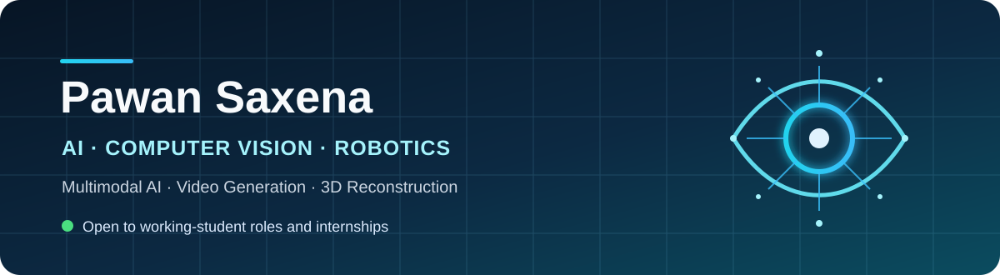

  

  
  
  
  
  

## Hello - I am Pawan

I am an M.Sc. Artificial Intelligence & Robotics student at the University of Technology Nuremberg. I build computer-vision systems that connect research ideas to measurable experiments, with current interests in multimodal AI, video generation, representation alignment, sequence recognition, and 3D reconstruction. Previously, I worked as a Senior Analyst - Data Science at Tiger Analytics and as a Technical Content Engineer at GeeksforGeeks.

I am currently open to **working-student roles (14-20 hours/week)** and **full-time internships**. I am based in Nuremberg and open to relocation.

## Selected work

| Project | What I built | Evidence |
| --- | --- | --- |
| **SceneWeaver** | A multi-agent refinement loop for narrative video generation, combining story-beat, continuity, and physics checks. | Weighted scoring, `0.76` acceptance threshold, up to `5` refinement passes; agentic I2V best realized intended physical actions. |
| **[ASCII Vision-Language Alignment](https://gitos.rrze.fau.de/lit25-26/making-llms-understand-images-via-ascii)** | A synthetic image-to-ASCII pipeline and structure-aware alignment approach using Stable Diffusion, Grounding DINO, SAM, CLIP, and SigLIP. | `50,000` samples; `62.7%` top-1 and `93.6%` top-5 retrieval; `90.14%` downstream accuracy. |
| **CAPTCHA Recognition with CRNN** | A sequence-recognition study comparing six CRNN variants with CTC decoding. | Best model: VGG16 + BiLSTM + CTC; `68.36%` sequence accuracy and `0.0937` CER on a `20k` validation set. |
| **[Deep 3D Reconstruction](https://gitos.rrze.fau.de/tyle94da.utn.de/ws25-3d-vision-and-geometry-group-project)** | An end-to-end reconstruction pipeline spanning sparse matching, dense monocular depth, neural rendering, and an external baseline. | LightGlue, MoGe, NeRF, Open3D, GTSAM, and VGGT; `72` depth maps and `864k` fused points. |
| **Drone Face Recognition** | One-shot identity recognition in aerial video using facial landmarks, CNN embeddings, and calibrated distance thresholds. | `0.6` was the most stable tolerance; `98-100%` activity-level accuracy in the reported evaluation. |

## Toolbox

`Python` · `Computer Vision` · `Deep Learning` · `Multimodal AI` · `Video Generation` · `3D Reconstruction` · `Representation Learning`

**Models and methods:** CLIP · SigLIP · DINOv2 · Stable Diffusion · Grounding DINO · SAM · VGG16 · BiLSTM · CTC · LightGlue · MoGe · NeRF · VGGT

**3D and optimization:** Open3D · GTSAM · sparse feature matching · monocular depth · point-cloud fusion · pose estimation

## How I work

- Start with an explicit evaluation question and measurable baseline.
- Compare alternatives instead of presenting only the final model.
- Analyze failure modes, not just aggregate scores.
- Turn limitations into concrete next experiments.

## Current direction

I am interested in improving motion-aware validation for generated video, robust pose estimation for neural reconstruction, and multimodal representations that preserve spatial structure.

  <strong>Interested in collaborating or discussing an opportunity?</strong> 
  <a href="mailto:saxenapawan224@gmail.com">Email</a> ·
  <a href="https://saxena224pawan.github.io/">Portfolio</a> ·
  <a href="https://github.com/Saxena224pawan">GitHub</a>

